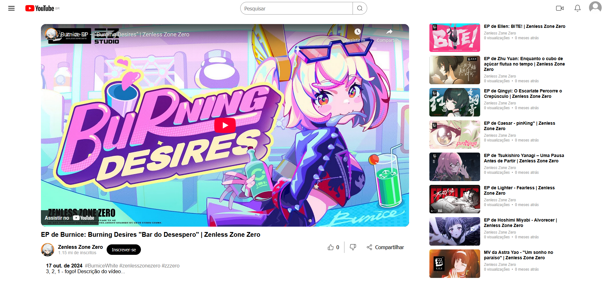

<h1 align="center">
YouTube Video Interface Clone 📽️
</h1>

This repository contains a YouTube video interface clone, built using **HTML** and **CSS**, with a focus on **Flexbox** for creating a responsive layout. The project demonstrates the application of modern CSS techniques to replicate a familiar and user-friendly interface.

## Project Overview

The goal of this project was to recreate a simplified version of YouTube's video interface, focusing on the following aspects:
- **Responsive Design**: Using Flexbox to ensure the layout adapts seamlessly to different screen sizes.
- **Styling**: Applying CSS to achieve a visually appealing and functional design.
- **Structure**: Organizing the HTML and CSS code for maintainability and scalability.

If you want to compare my result with the original YouTube interface, visit:
- [YouTube](https://www.youtube.com)

## Main Objectives

- **Apply Flexbox**: Use CSS Flexbox to create a responsive and flexible layout.
- **Recreate Key Components**: Build a video player, sidebar, and video recommendations section.

## Completed Project

### YouTube Interface Clone
  

## How to Run the Project

1. **Fork this repository** to your GitHub account.
2. **Clone the forked repository** to your computer:
   ```bash
   git clone https://github.com/annielymariah/youtube-video-interface-DIO
   ```
3. Navigate to the project folder:
   ```bash
   cd youtube-video-interface-DIO
   ```
4. Open the `index.html` file in your browser to view the interface.
